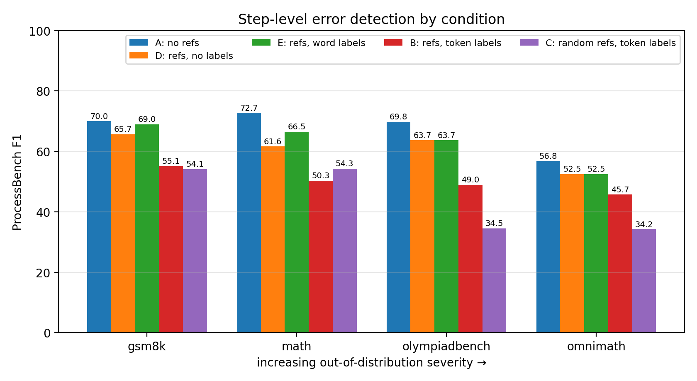

# Retrieval-Augmented PathFinder-PRM

**From Similar Examples to Error Types: Extending PathFinder-PRM with Retrieval-Augmented Verification**

Seminar project · Institute for Computational Linguistics, Heidelberg University
Pratik Goyal & Ashhad Raza Quadri · Supervisor: Lei Tang

**Report:** [`report/main.pdf`](report/main.pdf) (ACL format) · **Numbers:** [`docs/RESULTS.md`](docs/RESULTS.md) · **Artefacts:** [`results/`](results/)

---

## The question

Two papers improve step-level math graders in unrelated ways. **RetrievalPRM**
(Zhu et al. 2025, arXiv:2502.14361) shows the grader similar solved problems before it
judges a step — an open-book exam. **PathFinder-PRM** (Pala et al. 2025, arXiv:2505.19706)
replaces the binary correct/wrong verdict with a hierarchical one: first *what kind* of
error, then how good the step is. Nobody had combined them.

> Does inserting retrieval in front of PathFinder-PRM's error-typing stage make it better at
> identifying errors, especially on out-of-distribution problems — and does any gain survive
> a length-matched control?

Broken into three research questions:

- **RQ1** Do retrieved references make PathFinder-PRM better at locating errors, and does
  any gain grow on more out-of-distribution problems, as it does for RetrievalPRM?
- **RQ2** Is any change due to the *relevance* of the references, or just the extra text?
- **RQ3** Which part of a reference drives the change: the example, the judgement attached to
  it, or the form in which that judgement is written? (Exploratory: it arose after the first
  results.)

No training, no new data. Inference only, on the released 7B checkpoint, with the model's
prompt contract held byte-identical across conditions.

## The answer

**No. Retrieval does not help, and most of the damage comes from how the references' labels
are written.**

| | references shown | average F1 | vs A |
| --- | --- | ---: | ---: |
| **A** baseline | none | **67.3** | |
| **E** ablation | retrieved, labels as words | 62.9 | −4.4 |
| **D** ablation | retrieved, labels stripped | 60.9 | −6.5 |
| **B** treatment | retrieved, labels as `<+>` / `<->` | 50.0 | −17.3 |
| **C** control | **random**, labels as `<+>` / `<->` | 44.3 | −23.0 |

Three readings, in the order they matter:

**The verdict tokens do the damage, not the judgement.** Each reference in Condition B ends
with `Teacher's judgement: Math reasoning: <->, Consistency: <->`. Those two tokens are what
the scoring rule compares at the mask positions, and B puts four of them in the user turn on
every query. Writing the identical judgement as *correct* / *incorrect* (E) recovers 12.9
points (E→B, 95% CI [−19.0, −7.7], p < 0.0001) and is indistinguishable from showing no
label at all (D→E +2.0, [−2.2, +6.4]).

**Relevance helps a little, mainly where RetrievalPRM says it should.** C→B is +5.8
([−1.1, +12.8], p = 0.10) on average, +2.3 once pool-contaminated items are dropped. It is
~0 on GSM8K and MATH and +14.4 / +11.6 on OlympiadBench and Omni-MATH, the hardest and
uncontaminated subsets. Suggestive, not established, and never enough to offset the loss.

**The failure has a shape, and it is not in the error typing.** Stage 1 (math / consistency)
does not measurably change in any arm. The verdict tokens depress stage 2's correctness score
instead: false alarms on clean solutions rise from 16.4% to 34.2%, the blame lands before the
real error, and the only figure that improves is the miss rate. D and E barely move any of it.



Condition A lands at 67.3 against the paper's published 69.5, which is the anchor that makes
the rest worth reading. Measured at int4 on 50 solutions per subset; deltas between arms are
valid because all arms ran at identical precision, absolute values are not comparable to
bf16.

> **Correction.** The first run of B (46.3) silently used a fallback encoder that skipped
> Sentence-BERT's normalisation step, which degraded retrieval. It was caught because E's
> references did not match B's, fixed in `retrieval/encoder.py` with a regression test, and B
> was re-run. C draws random references and was verified unaffected. The degraded run is kept
> in `results/int4-b-fallback-encoder/` for the record.

**Full numbers, intervals, significance tests and limitations: [`docs/RESULTS.md`](docs/RESULTS.md).**
The artefacts behind them: [`results/`](results/).

## How the comparison is kept honest

The finding rests on five arms differing by one thing each, so the machinery that enforces
that is the important part of this repository.

| Guard | What it prevents |
| --- | --- |
| `scripts/check_parity.py` | Two arms differing anywhere but their one defining key. An ablation must *declare* the key it varies. |
| Stratified sampling | ProcessBench lists every erroneous solution first, so `--limit` draws a seeded, nested sample instead of slicing an all-error prefix. |
| Contamination guard + exclusion | 59.6% of MATH appears verbatim in the retrieval pool. The guard filters neighbours; the exclusion recomputes every table without the affected eval items. |
| Undefined ≠ zero | An absent population makes F1 undefined, and the metric says so instead of scoring it 0. This is what caught the sampling bug. |
| Pooled contrasts | Per-subset McNemar runs out of discordant solutions at this scale; the pooled test does not. |
| Frozen prompt contract | `<extra>` may never reach the user turn, the assistant turn must carry exactly two mask positions, and `scripts/verify_model_interface.py` re-checks both against the model card. |
| Encoder parity | The transformers-only fallback encoder is tested against Sentence-BERT vector for vector, and B, D and E were checked to receive identical references. This is what caught the fallback bug. |

## Quickstart

```bash
python -m venv .venv
.venv\Scripts\activate           # Windows; source .venv/bin/activate elsewhere
pip install -r requirements.txt
pip install -e .
```

**Check the plumbing** — no GPU needed:

```bash
python scripts/smoke.py
pytest
```

`smoke.py` needs no downloads and takes about five seconds. One test compares the fallback
encoder with Sentence-BERT and downloads the 90 MB `all-MiniLM-L6-v2` on first run; it skips
itself when the model cannot be loaded.

`smoke.py` runs every stage against a mock PRM and bundled fixtures, and asserts that the
control arm really is one: same reference count as the treatment, far lower similarity. Its
numbers are meaningless by construction; what it proves is that the pipeline is intact.

**Check the model contract** before trusting any real number:

```bash
python scripts/verify_model_interface.py
```

## Reproducing the study

```bash
python scripts/build_pool.py          --config configs/retrieval.yaml
python scripts/build_index.py         --config configs/retrieval.yaml
python scripts/check_contamination.py --config configs/retrieval.yaml   # read this first

python scripts/run_eval.py --config configs/pilot-int4.yaml           --limit 50  # A
python scripts/run_eval.py --config configs/pilot-int4-retrieval.yaml --limit 50  # B
python scripts/run_eval.py --config configs/pilot-int4-random.yaml    --limit 50  # C
python scripts/run_eval.py --config configs/pilot-int4-nolabels.yaml  --limit 50  # D
python scripts/run_eval.py --config configs/pilot-int4-wordlabels.yaml --limit 50 # E

# copy the five run directories into results/, then every contrast, profile and figure:
python report/collect_numbers.py
```

`report/collect_numbers.py` runs all eight contrasts (each with its `uncontaminated-` twin),
the verdict profile, the arm figure and the step-level stage analysis behind the report.

Runs are resumable: every solution is flushed to `predictions.jsonl` as it finishes, and
`--resume` skips what is already there, so an interrupted run costs at most one solution.

The `configs/pilot-int4-*.yaml` set is what produced the reported numbers on an 8 GB laptop.
On a 24 GB or larger GPU use `configs/baseline.yaml`, `retrieval.yaml`,
`control-random.yaml`, `ablation-nolabels.yaml` and `ablation-wordlabels.yaml` instead —
same design at bf16, where absolute F1 becomes comparable to the published 69.5. Compare
arms only within one precision; never an int4 number against a bf16 one.

## Hardware

Everything reported was run on one laptop: an Acer Nitro 16S AI with an NVIDIA GeForce
RTX 5070 Laptop GPU (8 GB VRAM). A 7B in bf16 needs ~15.2 GB of weights, so the reported run
uses int4 weight-only quantisation via torchao.

| Backend | `prm.backend` | Needs | Notes |
| --- | --- | --- | --- |
| int4 (torchao) | `int4` | ~6.3 GB VRAM | what produced these results; `lm_head` stays in bf16 |
| bf16 | `hf` | 20 GB+ VRAM | for numbers comparable to the paper |
| mock | `mock` | nothing | development only, numbers meaningless |
| fp16 + offload | `hf` + `max_memory` | any VRAM + disk | ~12 s per forward pass; correctness pilots only |

`int4_packing_format: tile_packed_to_4d` is the kernel that works on Blackwell (sm_120).
`lm_head` and the embeddings stay in bf16 deliberately: the verdict *is* a comparison of the
`<+>` and `<->` logits from that head, so quantising it would inject noise straight into the
measured quantity.

Cost of the reported run, 200 solutions per arm: A 55 min, C 2 h 38 m, B 3 h 01 m,
D 4 h 59 m, E about 5 h 35 m; about 17 GPU hours for the five arms and about 40 hours for the
whole project. The reference-carrying arms are slower because their prompts are two to three
times longer; retrieval itself is about 1% of step time. The longest Omni-MATH solutions spill
out of 8 GB into shared system RAM and can hit CUDA out-of-memory; rerun with `--resume`.

### Windows: a blocked pyarrow

A Windows Application Control policy can block pyarrow's DLLs, sometimes only its Parquet
extension and sometimes only for a while. `sentence-transformers` then fails to import through
`datasets`. `src/rapfprm/compat.py`, loaded by every script, handles both shapes: it hides
pyarrow or `datasets` when they cannot load, so evaluation still works (only
`scripts/build_pool.py` genuinely needs `datasets`). If the log says `Falling back to the
transformers-only mean-pooling encoder`, retrieval is using the fallback, which is now
numerically identical to Sentence-BERT.

## Layout

```
configs/      one YAML per arm; int4 pilots and bf16 equivalents
src/rapfprm/
  data/       ProcessBench loading and stratified sampling, retrieval-pool construction
  retrieval/  SBERT encoder, PCA + cosine index, two-stage retriever, random control
  prm/        PRM backends and prompt builders (the frozen contract lives here)
  eval/       the scoring runner and the official ProcessBench metric
  analysis/   contrasts, pooled tests, verdict profiling, figures
scripts/      command-line entry points
tests/        139 tests, including an end-to-end run on fixtures
results/      the committed artefacts behind docs/RESULTS.md
docs/         protocol, results, model-interface notes
report/       the ACL-format seminar report (main.tex, main.pdf) and its analysis scripts
```

## Documentation

- [`docs/RESULTS.md`](docs/RESULTS.md) — what was found, with intervals and limitations
- [`docs/EXPERIMENTS.md`](docs/EXPERIMENTS.md) — the protocol: arms, controls, sampling, what must be reported
- [`docs/MODEL_INTERFACE.md`](docs/MODEL_INTERFACE.md) — the frozen PathFinder-PRM contract and why it must not drift
- [`results/README.md`](results/README.md) — what each committed artefact is

## Open questions

- Why the verdict tokens depress stage 2 and not stage 1 is still a hypothesis
  (calibration of the one soft decision), not a tested mechanism.
- Whether relevance really helps on the hardest subsets needs the full benchmark; at 50
  solutions per subset the per-subset intervals barely clear zero.
- Error-type *accuracy* is unmeasured: ProcessBench has no gold error types.
- No bf16 arm. Every number here is int4.
- 50 solutions per subset. The pooled contrasts are adequately powered; the per-subset rows
  show shape, not significance.
- The protocol's sensitivity checks — guard at 0.85 and 0.99, `top_k_steps: 4` — have not
  been run.

## References

- Zhu et al. (2025). *Retrieval-Augmented Process Reward Model for Generalizable Mathematical
  Reasoning*. arXiv:2502.14361
- Pala et al. (2025). *Error Typing for Smarter Rewards: Improving Process Reward Models with
  Error-Aware Hierarchical Supervision*. arXiv:2505.19706
- Zheng et al. (2024). *ProcessBench: Identifying Process Errors in Mathematical Reasoning*.
  arXiv:2412.06559 · `Qwen/ProcessBench`
- Model: `declare-lab/PathFinder-PRM-7B` · Pool: `declare-lab/PathFinder-600K`
